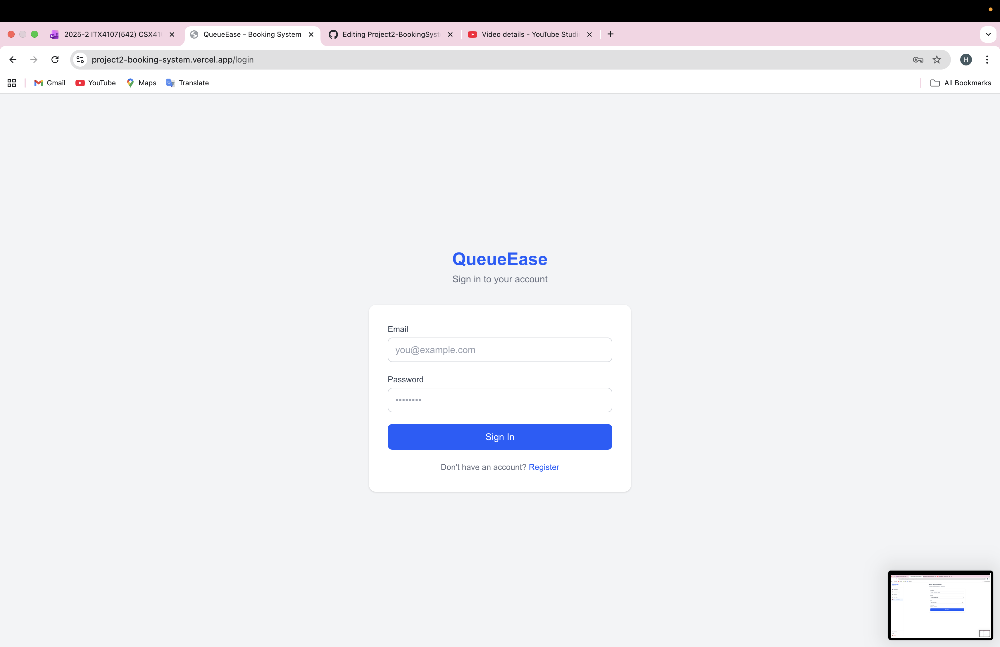
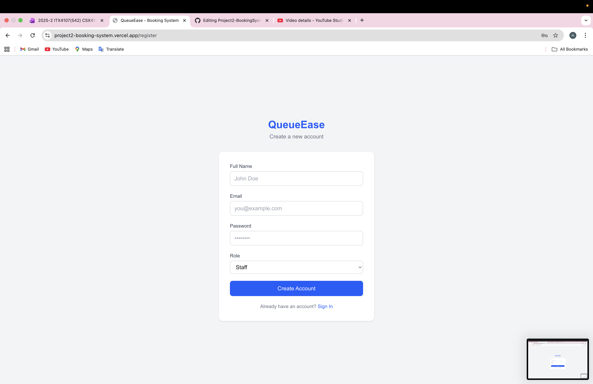
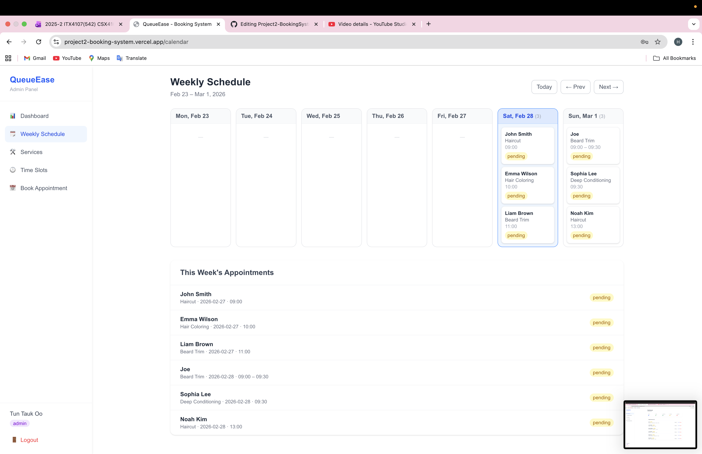
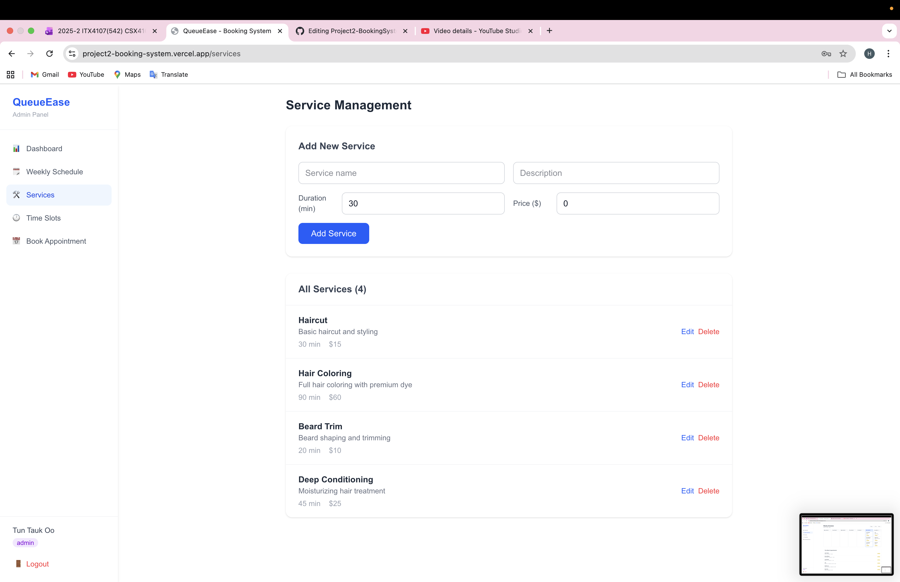
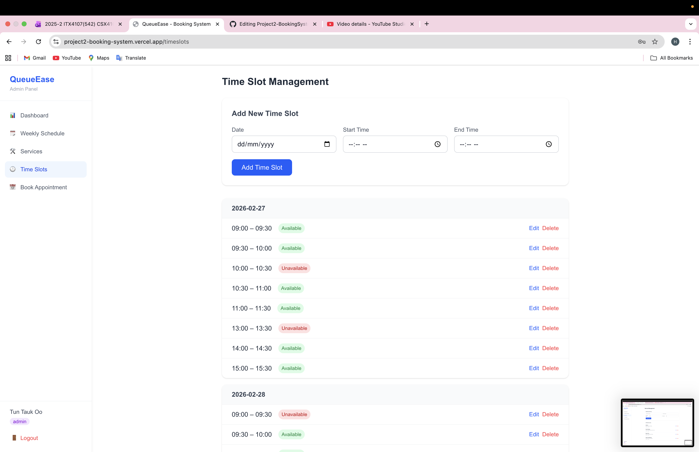
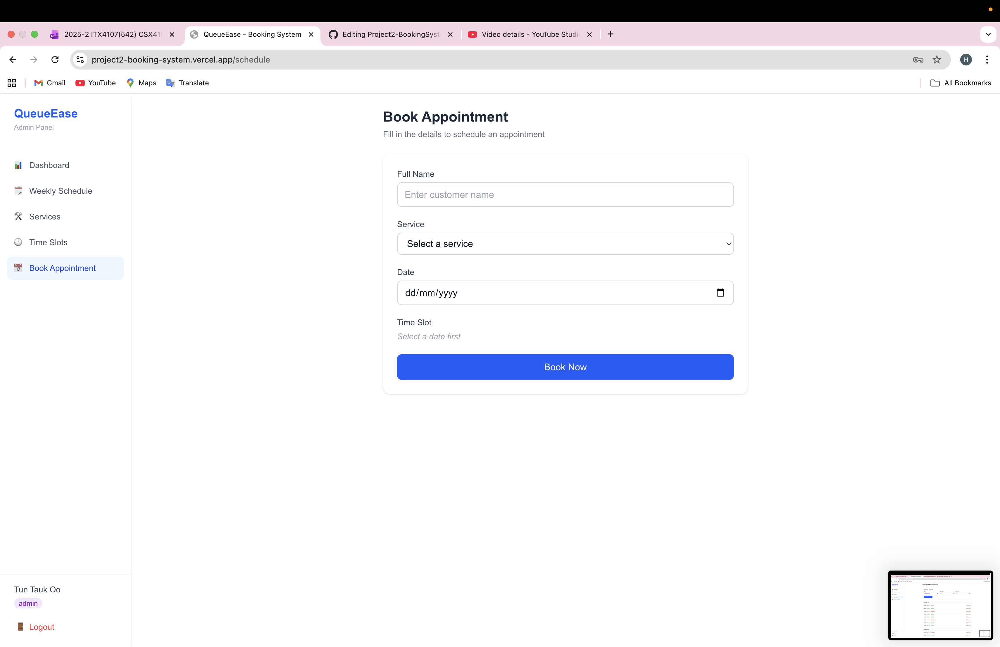
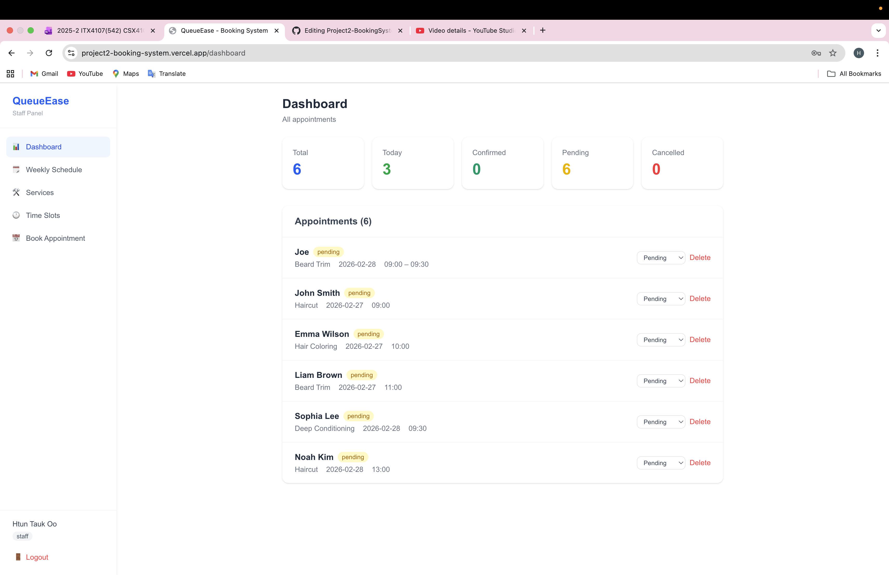
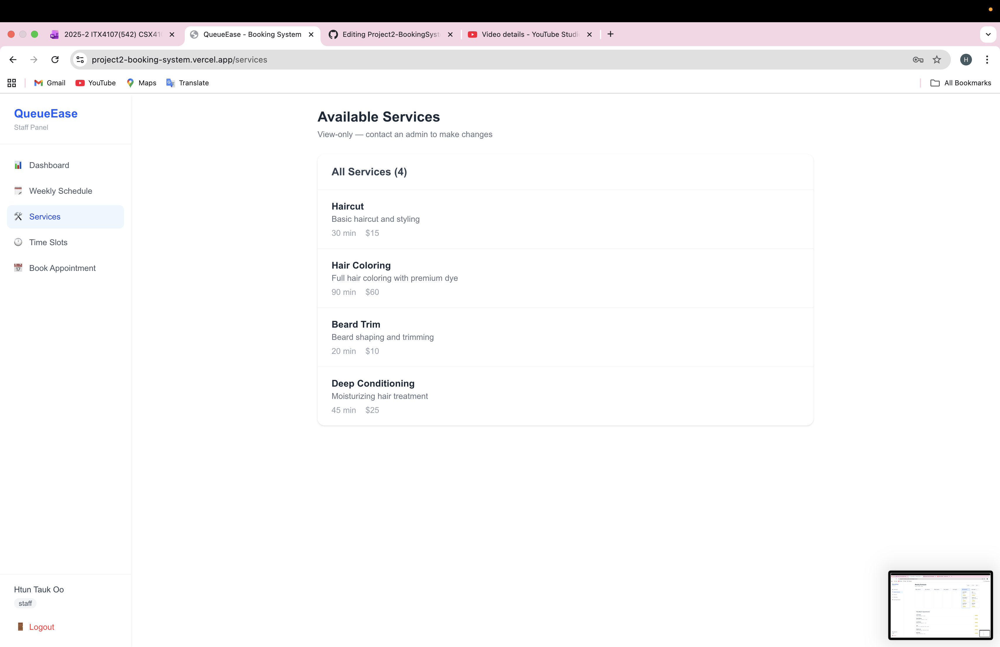
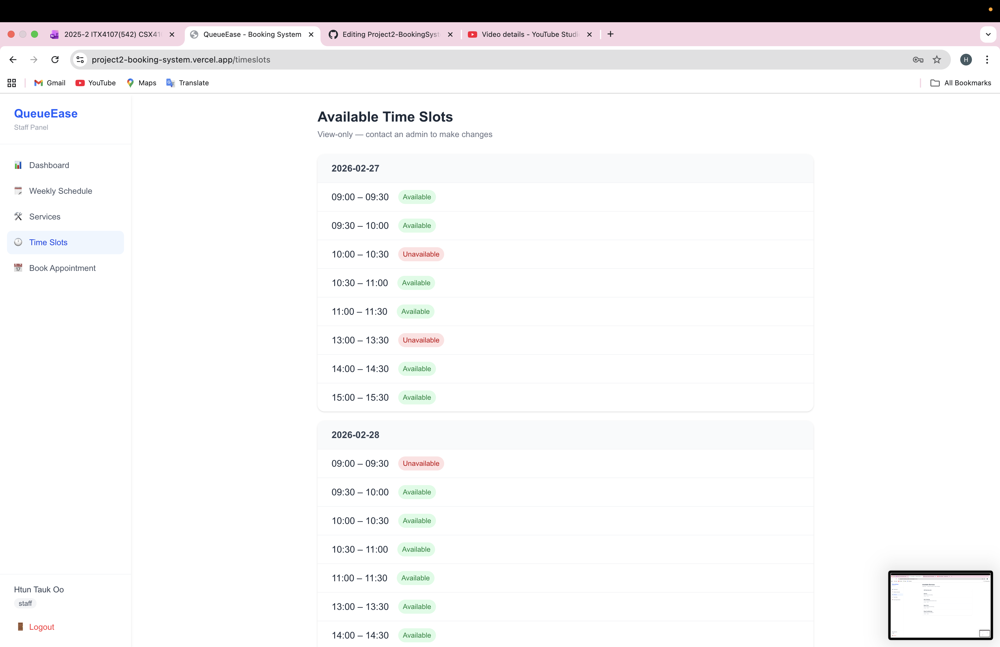

# QueueEase — Web-Based Appointment Booking System

A full-stack appointment booking system for small businesses (salons, clinics, tutors). Built with Next.js, Tailwind CSS, and MongoDB Atlas.

---

## Team Members

| Zwe Khant Lin | 6632710 |
| Tun Tauk Oo | 6611302 |

---

## Tech Stack

| Layer | Technology |
|-------|-----------|
| Frontend | Next.js 15 (App Router), React 19, TypeScript |
| Styling | Tailwind CSS 4 |
| Backend | Next.js API Routes |
| Database | MongoDB Atlas + Mongoose ODM |
| Auth | localStorage-based session (role-aware) |
| Deployment | Vercel + MongoDB Atlas |

---

## Features

### Authentication
- Login / Register with email and password
- Two roles: **Admin** and **Staff**
- Route protection — unauthenticated users are redirected to `/login`

### Dashboard
- Stats overview: Total, Today, Confirmed, Pending, Cancelled appointments
- Full appointment list with status badges
- Change appointment status (Pending / Confirmed / Cancelled)
- Edit appointment details (Admin only)
- Delete appointments (Admin and Staff)

### Weekly Schedule
- 7-day calendar view (Mon–Sun)
- Navigate between weeks (Prev / Next / Today)
- Today's column highlighted in blue
- Appointments displayed per day with status badges
- Weekly appointments list sorted by date and time

### Service Management
- View all services with name, description, duration, and price
- Add / Edit / Delete services (Admin only)
- Staff can view services (read-only)

### Time Slot Management
- View time slots grouped by date
- Add / Edit / Delete time slots (Admin only)
- Toggle availability per slot (Admin only)
- Staff can view slots (read-only)

### Book Appointment
- Select service from dropdown (populated from DB)
- Select date, then choose from available time slots for that date
- Booked time slots are automatically marked as unavailable
- Reads logged-in user's email from session

---

## Screenshots

### Authentication
| Login | Sign Up |
|-------|---------|
|  |  |

### Admin View
| Dashboard | Weekly Calendar |
|-----------|----------------|
|  |  |

| Services | Time Slots |
|----------|-----------|
|  |  |

| Book Appointment |
|-----------------|
|  |

### Staff View
| Dashboard | Weekly Calendar |
|-----------|----------------|
|  |  |

| Services | Time Slots |
|----------|-----------|
|  |  |

| Book Appointment |
|-----------------|
|  |

---

## Role Permissions

| Feature | Admin | Staff |
|---------|-------|-------|
| View Dashboard | ✅ | ✅ |
| Change appointment status | ✅ | ✅ |
| Edit appointment | ✅ | ❌ |
| Delete appointment | ✅ | ✅ |
| View Weekly Schedule | ✅ | ✅ |
| View Services | ✅ | ✅ |
| Add / Edit / Delete Services | ✅ | ❌ |
| View Time Slots | ✅ | ✅ |
| Add / Edit / Delete Time Slots | ✅ | ❌ |
| Toggle slot availability | ✅ | ❌ |
| Book Appointment | ✅ | ✅ |

